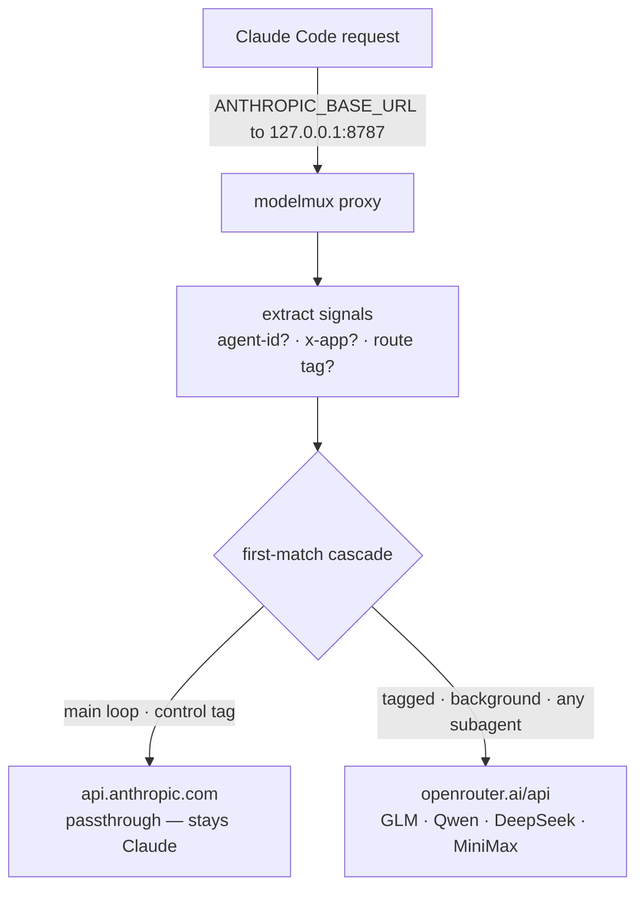

# modelmux

[](https://github.com/armenr/modelmux/actions/workflows/ci.yml)
[](LICENSE)
[](https://github.com/armenr/modelmux/releases/latest)

> **Stop paying Claude rates for your grep-the-repo subagents.**

modelmux is a tiny proxy you run in front of Claude Code. It keeps your
orchestrator on Claude and reroutes the subagents *you choose* to cheaper or
specialized models — GLM, Qwen, DeepSeek, MiniMax via OpenRouter. It ships as a
single self-contained binary: download one file and run it, no Bun, Docker, or
toolchain.

- **Orchestrator stays Claude** — the main loop never leaves Anthropic.
- **Subagents go where you point them** — by a route tag, a work-type, or "any subagent."
- **One file runs it** — [`routes.toml`](routes.toml) maps friendly aliases to models, hot-reloaded on save.
- **Your keys, the sanctioned way** — your OpenRouter key plus Claude Code's own auth passed through. No impersonation.

## Install

Download the binary for your platform from the
[latest release](https://github.com/armenr/modelmux/releases/latest) — the Bun
runtime is baked in, so there's nothing else to install:

| Platform | Asset |
|----------|-------|
| Linux x64 | `modelmux-linux-x64` |
| Linux arm64 | `modelmux-linux-arm64` |
| macOS x64 | `modelmux-darwin-x64` |
| macOS arm64 | `modelmux-darwin-arm64` |
| Windows x64 | `modelmux-windows-x64.exe` |

```bash
# macOS arm64 shown — swap the suffix for your platform
curl -fsSL https://github.com/armenr/modelmux/releases/latest/download/modelmux-darwin-arm64 -o modelmux
chmod +x modelmux
```

Each release also ships a `SHA256SUMS` file if you want to verify the download
(`shasum -a 256 -c SHA256SUMS`).

## Run it

```bash
OPENROUTER_API_KEY=sk-or-... ./modelmux
```

On first run it writes a default `routes.toml` next to itself and starts serving:

```text
[modelmux] wrote default routes.toml (edit it to change models)
modelmux listening on http://localhost:8787
```

That's the proxy. It watches `routes.toml` and applies edits live (keeping the
last good config if you save something invalid). `./modelmux` and
`./modelmux serve` do the same thing.

## Point Claude Code at it

Claude Code talks to modelmux when `ANTHROPIC_BASE_URL` points at the proxy. Set
it where Claude Code starts, then **restart Claude Code** — it reads that value
once at startup:

```bash
export ANTHROPIC_BASE_URL=http://127.0.0.1:8787
```

modelmux doesn't read `ANTHROPIC_BASE_URL`; Claude Code does. That's the whole
setup — dispatch a subagent and watch it route.

## See it route

The bundled `glm-researcher` agent starts with a route tag, so the proxy sends
that one subagent to OpenRouter while everything else stays on Claude:

```text
.claude/agents/glm-researcher.md  ->  <<route:flagship>>  ->  openrouter:z-ai/glm-5.2
```

Dispatch it from a Claude Code session, then read the decision log:

```bash
tail -n 2 decisions.jsonl
```

```text
{ "isSubagent": true,  "matchedRule": "tag:flagship", "upstream": "openrouter", "resolvedModel": "z-ai/glm-5.2" }
{ "isSubagent": false, "matchedRule": "default",      "upstream": "anthropic",  "resolvedModel": "passthrough" }
```

The research ran on GLM; your main loop never left Claude.

## How routing works

The proxy routes on **request signals**, not the requested model string (which
sidesteps a Claude Code bug where a subagent's model can fall back to the
parent's). The key signals:

- `x-claude-code-agent-id` — present **only** on subagent requests.
- `x-app` — `cli` (foreground) vs `cli-bg` (background work).
- `<<route:alias>>` — an explicit tag in an agent's system prompt.



The cascade in `routes.toml` is walked top to bottom, **first match wins**:

| Order | When | Routes to | Upstream |
| ----- | ---- | --------- | -------- |
| 1 | `<<route:flagship\|max\|reasoner\|review\|claude-review>>` | that alias | OpenRouter / Anthropic |
| 2 | `<<route:control>>` | `orchestrator` | Anthropic (passthrough) |
| 3 | `workType: background` (`x-app: cli-bg`) | `cheap` | OpenRouter |
| 4 | any other subagent | `flagship` | OpenRouter |
| 5 | default (the main loop) | `orchestrator` | Anthropic (passthrough) |

The main loop carries no `x-claude-code-agent-id`, so it never matches a subagent
rule — it falls to the default and stays on Claude.

### Work-type routing (beyond tags)

Row 3 matches a **work type** — a property of the request itself, so you don't
have to tag every agent. The proxy derives four: `background` (`x-app: cli-bg`),
`longContext` (estimated input tokens over `longContextThreshold`), `think` (an
extended-thinking block), and `webSearch` (a web-search tool). Only `background`
is wired up by default; `routes.toml` ships the others as commented-out examples.

## The model menu

Models live behind friendly aliases in [`routes.toml`](routes.toml), so you swap
one in a single place:

```toml
[models]
orchestrator = "anthropic:passthrough" # main loop — keep Claude's choice
flagship = "openrouter:z-ai/glm-5.2"
max = "openrouter:qwen/qwen3.7-max"
reasoner = "openrouter:deepseek/deepseek-v4-pro"
review = "openrouter:minimax/minimax-m3"
cheap = "openrouter:deepseek/deepseek-v4-flash"
claude-review = "anthropic:claude-sonnet-5"
```

The slugs above are illustrative — run `modelmux check-latest` to see which
models actually exist on OpenRouter right now.

## Flat-rate GLM: bring a Z.ai subscription

If you lean on GLM, OpenRouter's per-token pricing adds up fast. **Z.ai's GLM
Coding Plan** is a flat monthly subscription (see [z.ai](https://z.ai) for
current plans) with an Anthropic-compatible endpoint built for Claude Code — and
`zai` is a **built-in upstream**, so it's zero-config. Set your key and point an
alias at it:

```bash
export ZAI_API_KEY=<your z.ai api key>
```

```toml
[models]
orchestrator = "anthropic:passthrough" # brain stays on Claude
flagship = "zai:glm-5.2" # subagents run on GLM via your subscription
```

Your `flagship` subagents now ride your Z.ai subscription instead of OpenRouter's
per-token meter, while the orchestrator stays on Claude. It's sanctioned — your
own key, your own subscription, Z.ai's own documented endpoint. No impersonation.

Two things to know: use Z.ai's **bare** slug (`zai:glm-5.2`), not OpenRouter's
`z-ai/glm-5.2` prefix; and modelmux strips Claude Code's `anthropic-beta` headers
by default (safe). If you'd rather keep them, override with
`[upstreams]`: `zai = { base = "https://api.z.ai/api/anthropic", auth = "bearer:ZAI_API_KEY", stripBeta = false }`.

## Local & self-hosted models

`anthropic`, `openrouter`, and `zai` are built in, but you can point an alias at
any **Anthropic-Messages-compatible** endpoint by declaring it under
`[upstreams]`, then using it like any other model (`<name>:<slug>`).

The obvious use is a **local model**. Recent Ollama (v0.14+) speaks the Anthropic
Messages API natively, so no translation shim is needed — run your grunt-work
subagents on a local Qwen while the orchestrator stays on Claude:

```toml
[upstreams]
local = { base = "http://localhost:11434", auth = "none" }

[models]
orchestrator = "anthropic:passthrough" # brain stays on Claude
flagship = "local:qwen3-coder:30b" # subagents run on your local Qwen
cheap = "local:qwen3:8b"
```

`auth` is one of `passthrough` (forward Claude Code's own auth), `bearer:ENV_VAR`
(send `Authorization: Bearer $ENV_VAR`), or `none`. modelmux never forwards your
Claude auth to a `none`/`bearer` upstream, so your Anthropic token stays out of
the local process.

Runners that only speak the OpenAI format (LM Studio, llama.cpp, vLLM) need a
[LiteLLM](https://github.com/BerriAI/litellm) proxy in front to expose an
Anthropic endpoint; point the upstream `base` at that.

## Managing config from the CLI

`modelmux` with no arguments runs the proxy; the subcommands manage `routes.toml`:

```bash
modelmux models                              # list aliases -> upstream:slug
modelmux set flagship openrouter:z-ai/glm-6  # repoint an alias
modelmux use glm-researcher reasoner         # retarget an agent's <<route:>> tag
modelmux check-latest                        # verify configured slugs exist on OpenRouter
```

`modelmux models` prints the current menu:

```text
alias            upstream:slug
  orchestrator     anthropic:passthrough
  flagship         openrouter:z-ai/glm-5.2
  ...
```

`use` rewrites the `<<route:>>` tag inside `.claude/agents/<name>.md`, so it needs
a project with a `.claude/agents/` directory; `models` and `set` work anywhere.

## Configuration

Everything is controlled by `routes.toml` and a few environment variables:

| Variable | Default | Purpose |
|----------|---------|---------|
| `OPENROUTER_API_KEY` | unset | Required for any `openrouter:` route. If a request routes to OpenRouter while it's unset, that request fails with HTTP 400. |
| `ZAI_API_KEY` | unset | Required for any `zai:` route (Z.ai GLM Coding Plan). Same 400 behavior when unset. |
| `PORT` | `8787` | Listen port. |
| `MUX_ROUTES` | `./routes.toml` | Path to the routes config (also the first-run bootstrap target). |
| `MUX_LOG` | `./decisions.jsonl` | Path to the JSONL decision log — one line per proxied request. |
| `MUX_MODEL_<ALIAS>` | unset | Override one alias for a single run, e.g. `MUX_MODEL_FLAGSHIP=openrouter:qwen/qwen3.7-max ./modelmux`. Uppercase the alias, hyphens become underscores. |

## Troubleshooting

- **HTTP 400, `OPENROUTER_API_KEY is not set but a route needs it`** — a request
  routed to OpenRouter but the key is unset where modelmux runs. Set it and
  restart the binary.
- **Claude Code reports connection refused** — modelmux isn't running, or it's on
  a different port than `ANTHROPIC_BASE_URL`. Start it and check the listening
  line matches.
- **A subagent is still answered by Claude** — Claude Code wasn't restarted after
  `ANTHROPIC_BASE_URL` was set. That variable is read once at startup.

## Upgrading

Download the newer asset, mark it executable, and replace the old file. Your
`routes.toml` and `decisions.jsonl` are separate files and aren't touched.

## Security & scope — what this is (and isn't)

modelmux authenticates the **sanctioned** way: your own **OpenRouter API key**
for non-Claude routes, and **passthrough of Claude Code's own auth** for
Anthropic. It impersonates nothing.

It is **not** a tool for using a Claude/ChatGPT *subscription* outside its
official client, nor for pooling multiple subscriptions — those rely on
reverse-engineered first-party impersonation that violates provider terms and
risks account bans. Keep your keys in the environment; never commit them. See
[SECURITY.md](.github/SECURITY.md).

## Build from source / contribute

Prefer to run the proxy from a checkout, hack on it, or build the binary
yourself? **[docs/development.md](docs/development.md)** covers Bun/DevBox setup,
the `bin/mux` CLI, the test/lint gates, and the release build. Contributions
welcome — see [CONTRIBUTING.md](CONTRIBUTING.md).

```text
src/         proxy core — signals · route · upstreams · server · config · log · cli
routes.toml  the model menu + routing cascade
scripts/     check-latest · live-smoke · record-fixtures
test/        hermetic bun:test suite
.claude/     agents + onboarding skills that ship with the template
docs/        development guide + design history (see docs/README.md)
```

Inside a Claude Code session, the bundled skills — **`/getting-started`**,
**`/explain-modelmux`**, **`/switch-models`** — and the **`setup-assistant`**
agent walk you through setup and model switching.

## License

[MIT](LICENSE) © Armen Rostamian
