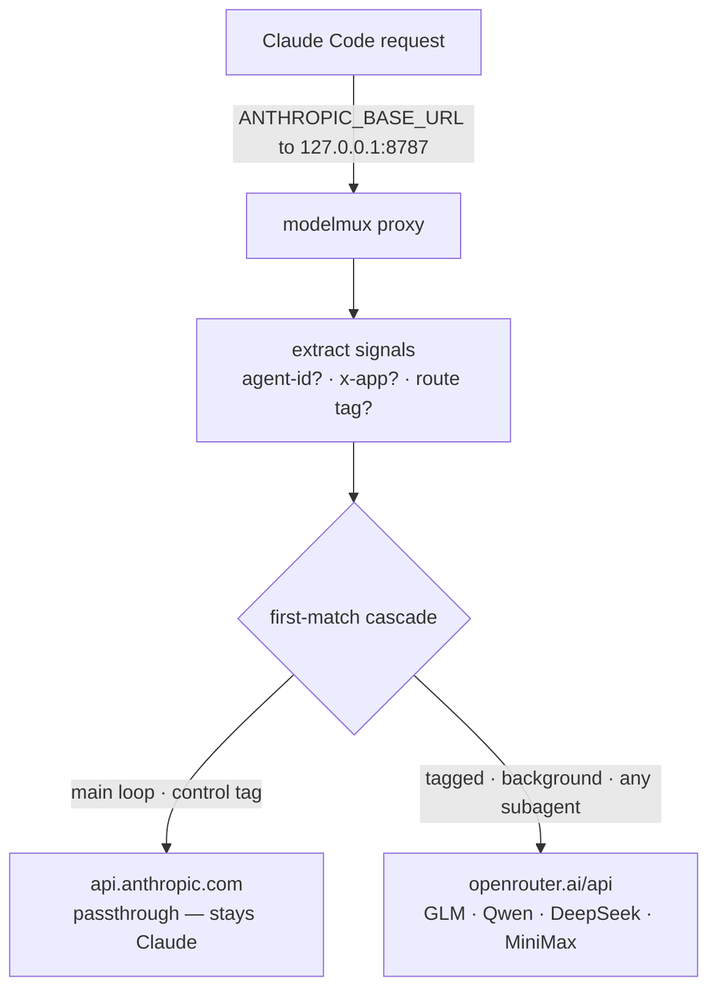

# modelmux

[](https://github.com/armenr/modelmux/actions/workflows/ci.yml)
[](LICENSE)
[](https://github.com/armenr/modelmux/releases/latest)

> **Stop paying Claude rates for your grep-the-repo subagents.**

**The stupid-simple way to run Claude Code subagents on other models.** Claude Code
picks its model from one global env var, so `modelmux` is a tiny proxy that sits in
front of it and reroutes the subagents *you choose* to cheaper or specialized models
(GLM, Qwen, DeepSeek, MiniMax via OpenRouter) — while your orchestrator stays on Claude.

**One proxy, one config file, no magic:**

- 📦 **Ships as one binary** — download a single file and run it. No Bun, Docker, or toolchain.
- 🧠 **Orchestrator stays Claude** — the main loop never leaves Anthropic.
- 🔀 **Subagents go where you point them** — by a route tag, work-type, or "any subagent."
- 📄 **One file runs it** — [`routes.toml`](routes.toml): friendly aliases → models, hot-reloaded on save.
- 🔑 **Your keys, the sanctioned way** — your OpenRouter key + Claude Code passthrough. No impersonation.

## Architecture



Requests flow through three pure steps — `extractSignals` (`src/signals.ts`) →
`route` (`src/route.ts`) → auth rewrite (`src/upstreams.ts`) — and SSE streams
pass straight through untouched. OpenRouter's Anthropic-compatible endpoint means
no request translation is needed.

## Quickstart

Download the binary, run it, point Claude Code at it. The Bun runtime is baked in,
so there's no toolchain to install.

```bash
# 1. Grab the binary for your platform — swap the suffix: modelmux-linux-x64 ·
#    -linux-arm64 · -darwin-x64 · -darwin-arm64 · -windows-x64.exe
curl -fsSL https://github.com/armenr/modelmux/releases/latest/download/modelmux-darwin-arm64 -o modelmux
chmod +x modelmux

# 2. Run it — writes a default routes.toml on first run, listens on :8787
OPENROUTER_API_KEY=sk-or-... ./modelmux

# 3. Point Claude Code at it (set this where Claude Code starts), then RESTART it
export ANTHROPIC_BASE_URL=http://127.0.0.1:8787
```

That's the whole setup. Dispatch a subagent and it routes to OpenRouter while your
main loop stays on Claude — the [**Worked example**](#worked-example--put-your-research-agent-on-glm)
below shows exactly what you'll see. Full binary usage — subcommands, env vars,
checksums, upgrading — is in **[docs/using-the-binary.md](docs/using-the-binary.md)**.

> **Running from a checkout** (from source, or hacking on modelmux)? →
> **[docs/development.md](docs/development.md)**. New here? Run the
> **`/getting-started`** skill or dispatch the **`setup-assistant`** agent — both
> walk the setup and verify each step.

## How routing works

The proxy routes on **request signals**, not the requested model string (which
sidesteps a Claude Code bug where a subagent's model can fall back to the
parent's). The key signals (`src/signals.ts`):

- `x-claude-code-agent-id` — present **only** on subagent requests (`isSubagent`).
- `x-app` — `cli` (foreground) vs `cli-bg` (background work).
- `<<route:alias>>` — an explicit tag in an agent's system prompt.

`route()` walks `routes.toml` top-to-bottom, **first match wins**:

| Order | When | Routes to | Upstream |
| ----- | ---- | --------- | -------- |
| 1 | `<<route:flagship\|max\|reasoner\|review\|claude-review>>` | that alias | OpenRouter / Anthropic |
| 2 | `<<route:control>>` | `orchestrator` | Anthropic (passthrough) |
| 3 | `workType: background` (`x-app: cli-bg`) | `cheap` | OpenRouter |
| 4 | any other subagent (`anySubagent`) | `flagship` | OpenRouter |
| 5 | default (the main loop) | `orchestrator` | Anthropic (passthrough) |

The main loop carries no `x-claude-code-agent-id`, so it never matches a subagent
rule — it falls to the default and **stays on Claude**. Want the full mental
model? Run the **`/explain-modelmux`** skill.

### Work-type routing (beyond tags)

Row 3 above matches a **work type** — a property of the request itself, so you
don't have to tag every agent. The proxy derives four:

- `background` — `x-app: cli-bg` (a background/side task)
- `longContext` — estimated input tokens exceed `longContextThreshold`
- `think` — the request carries an extended-thinking block
- `webSearch` — the request includes a web-search tool

**Only `background` is wired up by default.** `routes.toml` ships the others as
commented-out examples — uncomment one to route, e.g., big-context requests to a
roomier model. (That's the sole purpose of `longContextThreshold`: it's the
cutoff for the `longContext` type, and it does nothing until a `longContext`
rule exists.)

## Worked example — put your research agent on GLM

The bundled `glm-researcher` agent starts with a route tag, so the proxy sends that
one subagent to OpenRouter while everything else stays on Claude:

```text
.claude/agents/glm-researcher.md  →  <<route:flagship>>  →  openrouter:z-ai/glm-5.2
```

Dispatch it from a Claude Code session, then read the decision log:

```bash
tail -n 2 decisions.jsonl
```

```text
{ "isSubagent": true,  "matchedRule": "tag:flagship", "upstream": "openrouter", "resolvedModel": "z-ai/glm-5.2" }
{ "isSubagent": false, "matchedRule": "default",      "upstream": "anthropic",  "resolvedModel": "passthrough" }
```

The research ran on GLM; your main loop never left Claude. Prefer Qwen for it
instead? No file editing required:

```bash
modelmux use glm-researcher max     # point that agent at the `max` alias (qwen)
```

## The model menu

Models live behind friendly aliases in [`routes.toml`](routes.toml) — swap one
in a single place:

```toml
[models]
orchestrator = "anthropic:passthrough" # main loop — keep Claude's choice
flagship = "openrouter:z-ai/glm-5.2"
max = "openrouter:qwen/qwen3.7-max"
reasoner = "openrouter:deepseek/deepseek-v4-pro"
review = "openrouter:minimax/minimax-m3"
cheap = "openrouter:deepseek/deepseek-v4-flash"
claude-review = "anthropic:claude-sonnet-5"
```

> The slugs above are illustrative — run `modelmux check-latest` to see which
> models actually exist on OpenRouter right now, and `modelmux set` to update one.

The proxy **hot-reloads** `routes.toml` on save (and keeps the last good config
if an edit is invalid). Full switching guide: the **`/switch-models`** skill.

## The CLI

`modelmux` with no arguments runs the proxy; the subcommands manage `routes.toml`:

```bash
modelmux models                              # list aliases → upstream:slug
modelmux set flagship openrouter:z-ai/glm-6  # repoint an alias
modelmux use glm-researcher reasoner         # retarget an agent's <<route:>> tag
modelmux check-latest                        # verify configured slugs exist on OpenRouter
```

Or override an alias for a single run without editing files:
`MUX_MODEL_FLAGSHIP=openrouter:qwen/qwen3.7-max modelmux`.

From a checkout, the same commands are `bin/mux <cmd>` (and `bun run proxy` to
serve) — see [docs/development.md](docs/development.md).

## Security & scope — what this is (and isn't)

This template authenticates the **sanctioned** way: your own **OpenRouter API
key** for non-Claude routes, and **passthrough of Claude Code's own auth** for
Anthropic. It impersonates nothing.

It is **not** a tool for using a Claude/ChatGPT *subscription* outside its
official client, nor for pooling multiple subscriptions — those rely on
reverse-engineered first-party impersonation that violates provider terms and
risks account bans. Keep your keys in the environment; never commit them. See
[SECURITY.md](.github/SECURITY.md).

## Develop / from source

Prefer to run the proxy from source or hack on modelmux?
**[docs/development.md](docs/development.md)** covers Bun/DevBox setup, the
`bin/mux` CLI, the test/lint gates, and building the binary. Contributions
welcome — see [CONTRIBUTING.md](CONTRIBUTING.md).

```text
src/         proxy core — signals · route · upstreams · server · config · log · cli
routes.toml  the model menu + routing cascade
scripts/     check-latest · live-smoke · record-fixtures
test/        hermetic bun:test suite (+ recorded request fixtures)
.claude/     agents + onboarding skills that ship with the template
docs/        how-to guides + design history (see docs/README.md)
```

The bundled skills — **`/getting-started`**, **`/explain-modelmux`**,
**`/switch-models`** — and the **`setup-assistant`** agent ship in `.claude/` so a
fresh clone can use them immediately. Example subagents `glm-researcher`
(`<<route:flagship>>`) and `minimax-reviewer` (`<<route:review>>`) show how tag
routing works.

## License

[MIT](LICENSE) © Armen Rostamian
