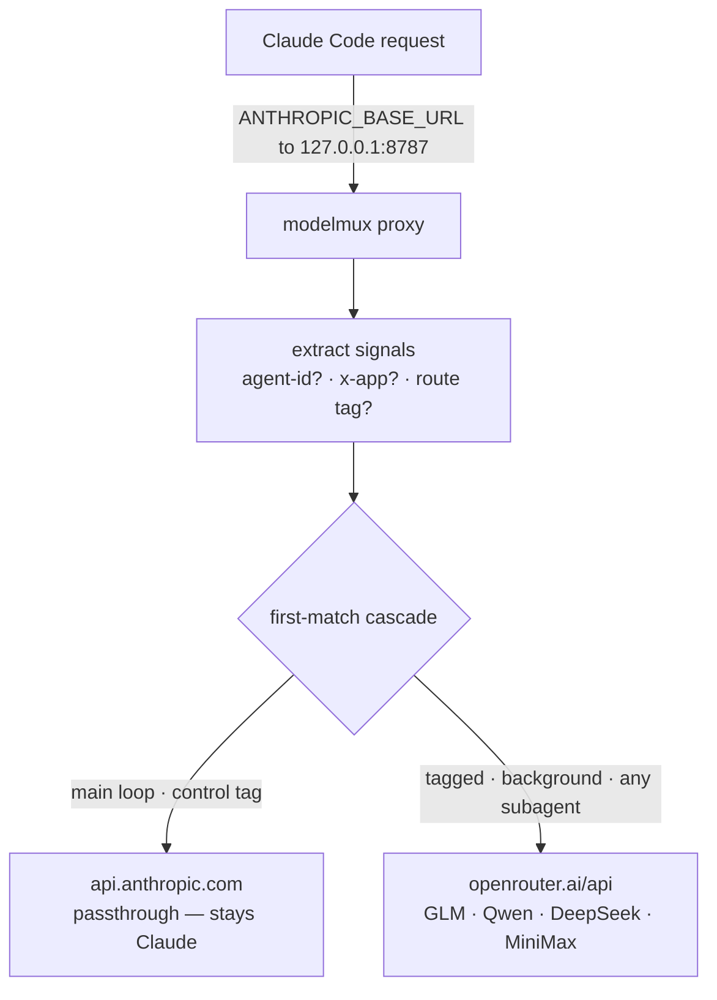

# modelmux

[](https://github.com/armenr/modelmux/actions/workflows/ci.yml)
[](LICENSE)
[](https://github.com/armenr/modelmux/releases/latest)

> **Stop paying Claude rates for your grep-the-repo subagents.**

modelmux is a tiny proxy you run in front of Claude Code. It keeps your
orchestrator on Claude and reroutes the subagents *you choose* to cheaper or
specialized models (GLM, Qwen, DeepSeek, MiniMax) via OpenRouter, a flat-rate
**Z.ai GLM subscription**, or your own local model. It ships as a single
self-contained binary: download one file and run it, no Bun, Docker, or toolchain.

- **Orchestrator stays Claude** — the main loop never leaves Anthropic.
- **Subagents go where you point them** — by a route tag, a work-type, or "any subagent."
- **Flat-rate, not per-token** — send GLM subagents to a [Z.ai GLM Coding Plan](#flat-rate-glm-bring-a-zai-subscription) subscription (the built-in `zai` upstream) instead of OpenRouter's per-token meter, or to a local model.
- **One file runs it** — [`routes.toml`](routes.toml) maps friendly aliases to models, hot-reloaded on save.
- **Your keys, the sanctioned way** — your OpenRouter key plus Claude Code's own auth passed through. No impersonation.

## Install

Download the binary for your platform from the
[latest release](https://github.com/armenr/modelmux/releases/latest) — the Bun
runtime is baked in, so there's nothing else to install:

| Platform | Asset |
|----------|-------|
| Linux x64 | `modelmux-linux-x64` |
| Linux arm64 | `modelmux-linux-arm64` |
| macOS x64 | `modelmux-darwin-x64` |
| macOS arm64 | `modelmux-darwin-arm64` |
| Windows x64 | `modelmux-windows-x64.exe` |

```bash
# macOS arm64 shown — swap the suffix for your platform
curl -fsSL https://github.com/armenr/modelmux/releases/latest/download/modelmux-darwin-arm64 -o modelmux
chmod +x modelmux
```

Each release also ships a `SHA256SUMS` file if you want to verify the download
(`shasum -a 256 -c SHA256SUMS`).

## Run it

```bash
OPENROUTER_API_KEY=sk-or-... ./modelmux
```

On first run it writes a default `routes.toml` next to itself and starts serving:

```text
[modelmux] wrote default routes.toml (edit it to change models)
modelmux listening on http://localhost:8787
```

That's the proxy. It watches `routes.toml` and applies edits live (keeping the
last good config if you save something invalid). `./modelmux` and
`./modelmux serve` do the same thing.

## Point Claude Code at it

Claude Code talks to modelmux when `ANTHROPIC_BASE_URL` points at the proxy. Set
it where Claude Code starts, then **restart Claude Code** — it reads that value
once at startup:

```bash
export ANTHROPIC_BASE_URL=http://127.0.0.1:8787
```

modelmux doesn't read `ANTHROPIC_BASE_URL`; Claude Code does. That's the whole
setup — dispatch a subagent and watch it route.

## See it route

The bundled `glm-researcher` agent starts with a route tag, so the proxy sends
that one subagent to OpenRouter while everything else stays on Claude:

```text
.claude/agents/glm-researcher.md  ->  <<route:flagship>>  ->  openrouter:z-ai/glm-5.2
```

Dispatch it from a Claude Code session, then read the decision log:

```bash
tail -n 2 decisions.jsonl
```

```text
{ "isSubagent": true,  "matchedRule": "tag:flagship", "upstream": "openrouter", "resolvedModel": "z-ai/glm-5.2" }
{ "isSubagent": false, "matchedRule": "default",      "upstream": "anthropic",  "resolvedModel": "passthrough" }
```

The research ran on GLM; your main loop never left Claude.

## How routing works

The proxy routes on **request signals**, not the requested model string (which
sidesteps a Claude Code bug where a subagent's model can fall back to the
parent's). The key signals:

- `x-claude-code-agent-id` — present **only** on subagent requests.
- `x-app` — `cli` (foreground) vs `cli-bg` (background work).
- `<<route:alias>>` — an explicit tag in an agent's system prompt.


```mermaid
flowchart TD
    CC["Claude Code request"] -->|"ANTHROPIC_BASE_URL to 127.0.0.1:8787"| MUX["modelmux proxy"]
    MUX --> SIG["extract signals<br/>agent-id? · x-app? · route tag?"]
    SIG --> Q{"first-match cascade"}
    Q -->|"main loop · control tag"| CLAUDE["api.anthropic.com<br/>passthrough — stays Claude"]
    Q -->|"tagged · background · any subagent"| OUT["openrouter.ai/api<br/>GLM · Qwen · DeepSeek · MiniMax"]
```

The cascade in `routes.toml` is walked top to bottom, **first match wins**:

| Order | When | Routes to | Upstream |
| ----- | ---- | --------- | -------- |
| 1 | `<<route:flagship\|max\|reasoner\|review\|claude-review>>` | that alias | OpenRouter / Anthropic |
| 2 | `<<route:control>>` | `orchestrator` | Anthropic (passthrough) |
| 3 | `workType: background` (`x-app: cli-bg`) | `cheap` | OpenRouter |
| 4 | any other subagent | `flagship` | OpenRouter |
| 5 | default (the main loop) | `orchestrator` | Anthropic (passthrough) |

The main loop carries no `x-claude-code-agent-id`, so it never matches a subagent
rule — it falls to the default and stays on Claude.

### Work-type routing (beyond tags)

Row 3 matches a **work type** — a property of the request itself, so you don't
have to tag every agent. The proxy derives four: `background` (`x-app: cli-bg`),
`longContext` (estimated input tokens over `longContextThreshold`), `think` (an
extended-thinking block), and `webSearch` (a web-search tool). Only `background`
is wired up by default; `routes.toml` ships the others as commented-out examples.

## The model menu

Models live behind friendly aliases in [`routes.toml`](routes.toml), so you swap
one in a single place:

```toml
[models]
orchestrator = "anthropic:passthrough" # main loop — keep Claude's choice
flagship = "openrouter:z-ai/glm-5.2"
max = "openrouter:qwen/qwen3.7-max"
reasoner = "openrouter:deepseek/deepseek-v4-pro"
review = "openrouter:minimax/minimax-m3"
cheap = "openrouter:deepseek/deepseek-v4-flash"
claude-review = "anthropic:claude-sonnet-5"
```

The slugs above are illustrative — run `modelmux check-latest` to see which
models actually exist on OpenRouter right now.

## Subscription-backed models

Per-token pricing adds up fast. Several vendors now sell **flat-rate coding
subscriptions** with Anthropic-compatible endpoints, which is exactly the shape
modelmux forwards to — so they need no translation layer and no `[upstreams]`
block, just an env var and a bare slug.

| Subscription | Upstream | Env var | Slugs |
|---|---|---|---|
| Z.ai GLM Coding Plan | `zai` (built in) | `ZAI_API_KEY` | `glm-5.2`, `glm-4.7` |
| Kimi Code (Moonshot) | `kimi` (built in) | `KIMI_API_KEY` | `k3` (~1M ctx), `k3-256k` (capped), `kimi-for-coding`, `kimi-for-coding-highspeed` |
| GPT / Codex | — see [below](#gpt--codex-why-its-not-built-in) | — | — |

Both built-ins are your own key against the vendor's own documented endpoint —
no impersonation, nothing pooled.

### Flat-rate GLM: bring a Z.ai subscription

If you lean on GLM, OpenRouter's per-token pricing adds up fast. **Z.ai's GLM
Coding Plan** is a flat monthly subscription (see [z.ai](https://z.ai) for
current plans) with an Anthropic-compatible endpoint built for Claude Code — and
`zai` is a **built-in upstream**, so it's zero-config. Set your key and point an
alias at it:

```bash
export ZAI_API_KEY=<your z.ai api key>
```

```toml
[models]
orchestrator = "anthropic:passthrough" # brain stays on Claude
flagship = "zai:glm-5.2" # subagents run on GLM via your subscription
```

Your `flagship` subagents now ride your Z.ai subscription instead of OpenRouter's
per-token meter, while the orchestrator stays on Claude. It's sanctioned — your
own key, your own subscription, Z.ai's own documented endpoint. No impersonation.

Two things to know: use Z.ai's **bare** slug (`zai:glm-5.2`), not OpenRouter's
`z-ai/glm-5.2` prefix; and modelmux strips Claude Code's `anthropic-beta` headers
by default (safe). If you'd rather keep them, override with
`[upstreams]`: `zai = { base = "https://api.z.ai/api/anthropic", auth = "bearer:ZAI_API_KEY", stripBeta = false }`.

### Kimi K3: bring a Kimi Code subscription

**Kimi Code** is Moonshot's flat-rate coding plan — quota-based (refreshing on a
rolling window) rather than per-token. It speaks the Anthropic Messages API, so
`kimi` is a **built-in upstream** too:

```bash
export KIMI_API_KEY=<key from the Kimi Code console>
```

```toml
[models]
orchestrator = "anthropic:passthrough"
flagship = "kimi:k3" # full ~1M context; best for large-codebase work
```

K3 is a **1,048,576-token (~1M) context** model. On Kimi Code the *usable* window is
tiered by plan — lower tiers cap around 256K, higher tiers get the full 1M — so
`k3-256k` is the **capped** variant, not a bigger one. Reach for plain `k3` unless
you specifically want the cap.

**Mind the split — this is the one thing that will bite you.** Moonshot sells two
different products and they are not interchangeable:

| | Host | Model ids | Key |
|---|---|---|---|
| **Kimi Code** (subscription) | `api.kimi.com/coding` | `k3`, `k3-256k`, `kimi-for-coding`, `kimi-for-coding-highspeed` | Kimi Code console |
| Moonshot API (metered) | `api.moonshot.ai/anthropic` | `kimi-k3` | `MOONSHOT_API_KEY` |

A subscription key will not authenticate against the metered host, and the model
ids differ (`k3` vs `kimi-k3`). The built-in `kimi` upstream is the
**subscription**. For the metered API, declare it yourself:

```toml
[upstreams]
moonshot = { base = "https://api.moonshot.ai/anthropic", auth = "bearer:MOONSHOT_API_KEY" }
```

### GPT / Codex: why it's not built-in

Codex is deliberately **not** a built-in upstream, for a reason that isn't
laziness: it doesn't fit the shape modelmux forwards.

Every other upstream here exposes an Anthropic **Messages** endpoint, so modelmux
swaps a header and a model id and gets out of the way. Codex subscription access
goes to an undocumented ChatGPT backend that speaks OpenAI's **Responses** schema,
authenticated by a ChatGPT session rather than an API key. Supporting it natively
would mean a bidirectional protocol translator — streaming, tool calls, thinking
blocks — built on an endpoint its own vendor doesn't document and can change
without notice. That's not an upstream entry; it's a subsystem with a moving
foundation, and it would be the most fragile code in this repo.

There's also a licensing question worth reading before you wire anything: OpenAI
treats ChatGPT subscriptions and the API as separate products, and programmatic
use of a subscription sits somewhere between "personally endorsed for your own
use" and "against the terms" depending on who you ask and what you're doing with
it. Pooling or reselling is clearly out. **Check the current terms yourself and
decide for your own account** — modelmux won't make that call for you by shipping
a built-in that implies it's settled.

If you've decided it's fine for your own account, **it works today with no
modelmux change** — and you don't need a bespoke shim, because
[LiteLLM](https://docs.litellm.ai) already does both halves. It's the same
gateway this README recommends for LM Studio and llama.cpp, so if you run local
models you may already have it.

LiteLLM authenticates to a ChatGPT subscription with an **OAuth device-code
flow** (it prints a code and a URL, you approve in the browser, tokens are cached
locally — no API key), and it serves an **Anthropic-compatible `/v1/messages`
endpoint**, which is exactly what modelmux forwards. Streaming and tool calls
are supported.

**1. Point LiteLLM at your subscription** (`config.yaml`):

```yaml
model_list:
  - model_name: chatgpt/gpt-5.3-codex
    model_info:
      mode: responses
    litellm_params:
      model: chatgpt/gpt-5.3-codex
```

```bash
litellm --config config.yaml   # serves http://0.0.0.0:4000; approve the device code once
```

**2. Point modelmux at LiteLLM:**

```toml
[upstreams]
codex = { base = "http://localhost:4000", auth = "none" } # or bearer:LITELLM_API_KEY if you set a master key

[models]
flagship = "codex:chatgpt/gpt-5.3-codex"
```

Other model names LiteLLM exposes on the subscription include
`chatgpt/gpt-5.4`, `chatgpt/gpt-5.4-pro`, `chatgpt/gpt-5.3-codex-spark` and
`chatgpt/gpt-5.3-instant`. LiteLLM strips the fields the subscription backend
rejects (`max_tokens` and metadata) for you.

That keeps the undocumented endpoint and the terms exposure inside a
purpose-built, actively maintained gateway on your own machine — rather than
baked into a binary we ship to everyone.

## Local & self-hosted models

`anthropic`, `openrouter`, and `zai` are built in, but you can point an alias at
any **Anthropic-Messages-compatible** endpoint by declaring it under
`[upstreams]`, then using it like any other model (`<name>:<slug>`).

The obvious use is a **local model**. Recent Ollama (v0.14+) speaks the Anthropic
Messages API natively, so no translation shim is needed — run your grunt-work
subagents on a local Qwen while the orchestrator stays on Claude:

```toml
[upstreams]
local = { base = "http://localhost:11434", auth = "none" }

[models]
orchestrator = "anthropic:passthrough" # brain stays on Claude
flagship = "local:qwen3-coder:30b" # subagents run on your local Qwen
cheap = "local:qwen3:8b"
```

`auth` is one of `passthrough` (forward Claude Code's own auth), `bearer:ENV_VAR`
(send `Authorization: Bearer $ENV_VAR`), or `none`. modelmux never forwards your
Claude auth to a `none`/`bearer` upstream, so your Anthropic token stays out of
the local process.

Runners that only speak the OpenAI format (LM Studio, llama.cpp, vLLM) need a
[LiteLLM](https://github.com/BerriAI/litellm) proxy in front to expose an
Anthropic endpoint; point the upstream `base` at that.

## Managing config from the CLI

`modelmux` with no arguments runs the proxy; the subcommands manage `routes.toml`:

```bash
modelmux models                              # list aliases -> upstream:slug
modelmux set flagship openrouter:z-ai/glm-6  # repoint an alias
modelmux tag kit-agent control               # add a FIRST <<route:>> tag to an untagged agent
modelmux use glm-researcher reasoner         # retarget an agent's existing <<route:>> tag
modelmux check-latest                        # verify configured slugs exist on OpenRouter
```

`modelmux models` prints the current menu:

```text
alias            upstream:slug
  orchestrator     anthropic:passthrough
  flagship         openrouter:z-ai/glm-5.2
  ...
```

`tag` and `use` both edit `.claude/agents/<name>.md`, so they need a project with a
`.claude/agents/` directory; `models` and `set` work anywhere. They are deliberately
split and each refuses the other's job: `use` **retargets an existing** tag and errors
on a file that has none, `tag` **adds a first** tag and errors on a file that already
has one. Neither can report a false success.

**Third-party agents you install are untagged.** An agent crew from a docs kit, a
starter pack, or a teammate ships without a `<<route:>>` tag, so under the default
`anySubagent` catch-all every one of them routes to whatever that rule names — quietly,
with nothing in the tool's output saying so. If you want them on Claude instead, tag
them for passthrough:

```bash
modelmux tag some-installed-agent control     # -> orchestrator (anthropic:passthrough)
```

`control` is the alias to reach for here: its route rule sits *above* `anySubagent` and
resolves to passthrough, so the agent stays on Claude and on whatever model Claude Code
itself picked. That matters if anything downstream — a dispatch gate, a review policy —
asserts a model pin, because under any other tag the cascade, not the pin, decides what
answers.

You don't have to remember to check. The proxy names untagged agents at startup:

```text
modelmux listening on http://localhost:8787
[modelmux] 2 agent(s) in .claude/agents/ carry no <<route:>> tag and will be routed
  by the anySubagent rule to 'flagship' (openrouter:z-ai/glm-5.2):
    - kit-auditor
    - kit-planner
  Pin one to Claude with:  modelmux tag <name> control
```

It stays quiet when there's nothing to act on — no `anySubagent` rule, or one that
resolves to passthrough (still Claude, so not a diversion), or every agent already
tagged.

## Configuration

Everything is controlled by `routes.toml` and a few environment variables:

| Variable | Default | Purpose |
|----------|---------|---------|
| `OPENROUTER_API_KEY` | unset | Required for any `openrouter:` route. If a request routes to OpenRouter while it's unset, that request fails with HTTP 400. |
| `ZAI_API_KEY` | unset | Required for any `zai:` route (Z.ai GLM Coding Plan). Same 400 behavior when unset. |
| `PORT` | `8787` | Listen port. |
| `MUX_ROUTES` | `./routes.toml` | Path to the routes config (also the first-run bootstrap target). |
| `MUX_LOG` | `./decisions.jsonl` | Path to the JSONL decision log — one line per proxied request. |
| `MUX_MODEL_<ALIAS>` | unset | Override one alias for a single run, e.g. `MUX_MODEL_FLAGSHIP=openrouter:qwen/qwen3.7-max ./modelmux`. Uppercase the alias, hyphens become underscores. |

## Troubleshooting

- **HTTP 400, `OPENROUTER_API_KEY is not set but a route needs it`** — a request
  routed to OpenRouter but the key is unset where modelmux runs. Set it and
  restart the binary.
- **Claude Code reports connection refused** — modelmux isn't running, or it's on
  a different port than `ANTHROPIC_BASE_URL`. Start it and check the listening
  line matches.
- **A subagent is still answered by Claude** — Claude Code wasn't restarted after
  `ANTHROPIC_BASE_URL` was set. That variable is read once at startup.

## Upgrading

Download the newer asset, mark it executable, and replace the old file. Your
`routes.toml` and `decisions.jsonl` are separate files and aren't touched.

## Security & scope — what this is (and isn't)

modelmux authenticates the **sanctioned** way: your own **OpenRouter API key**
for non-Claude routes, and **passthrough of Claude Code's own auth** for
Anthropic. It impersonates nothing.

It is **not** a tool for using a Claude/ChatGPT *subscription* outside its
official client, nor for pooling multiple subscriptions — those rely on
reverse-engineered first-party impersonation that violates provider terms and
risks account bans. Keep your keys in the environment; never commit them. See
[SECURITY.md](.github/SECURITY.md).

## Build from source / contribute

Prefer to run the proxy from a checkout, hack on it, or build the binary
yourself? **[docs/development.md](docs/development.md)** covers Bun/DevBox setup,
the `bin/mux` CLI, the test/lint gates, and the release build. Contributions
welcome — see [CONTRIBUTING.md](CONTRIBUTING.md).

```text
src/         proxy core — signals · route · upstreams · server · config · log · cli
routes.toml  the model menu + routing cascade
scripts/     check-latest · live-smoke · record-fixtures
test/        hermetic bun:test suite
.claude/     agents + onboarding skills that ship with the template
docs/        development guide + design history (see docs/README.md)
```

Inside a Claude Code session, the bundled skills — **`/getting-started`**,
**`/explain-modelmux`**, **`/switch-models`** — and the **`setup-assistant`**
agent walk you through setup and model switching.

## License

[MIT](LICENSE) © Armen Rostamian
