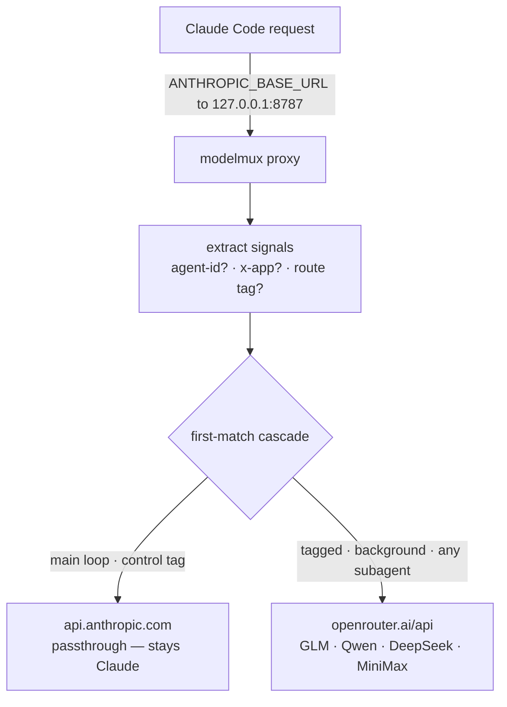

# modelmux

[](https://github.com/armenr/modelmux/actions/workflows/ci.yml)
[](LICENSE)
[](https://github.com/armenr/modelmux/releases/latest)

> **Stop paying Claude rates for your grep-the-repo subagents.**

modelmux is a tiny proxy you run in front of Claude Code. It keeps your
orchestrator on Claude and reroutes the subagents *you choose* to cheaper or
specialized models — via OpenRouter, a flat-rate **subscription you already pay
for** (Z.ai GLM, Kimi Code, or ChatGPT/Codex), or a model on your own machine.
It ships as a single self-contained binary: download one file and run it, no Bun,
Docker, or toolchain.

- **Orchestrator stays Claude** — the main loop never leaves Anthropic.
- **Subagents go where you point them** — by a route tag, a work-type, or "any subagent."
- **Flat-rate, not per-token** — put subagents on a [subscription](#subscription-backed-models) you already have: `zai`, `kimi` and `codex` are built in, no `[upstreams]` block needed.
- **Three wire formats, one binary** — Anthropic Messages, OpenAI [Chat Completions and Responses](#wire-formats-what-modelmux-can-talk-to). LM Studio, llama.cpp and vLLM need **no proxy in front**.
- **One file runs it** — [`routes.toml`](routes.toml) maps friendly aliases to models, hot-reloaded on save.
- **Your keys, your account** — your own credentials, nothing pooled, no impersonation. The Codex path has [caveats worth reading](#gpt--codex-bring-a-chatgpt-subscription).

## Install

Download the binary for your platform from the
[latest release](https://github.com/armenr/modelmux/releases/latest) — the Bun
runtime is baked in, so there's nothing else to install:

| Platform | Asset |
|----------|-------|
| Linux x64 | `modelmux-linux-x64` |
| Linux arm64 | `modelmux-linux-arm64` |
| macOS x64 | `modelmux-darwin-x64` |
| macOS arm64 | `modelmux-darwin-arm64` |
| Windows x64 | `modelmux-windows-x64.exe` |

```bash
# macOS arm64 shown — swap the suffix for your platform
curl -fsSL https://github.com/armenr/modelmux/releases/latest/download/modelmux-darwin-arm64 -o modelmux
chmod +x modelmux
```

Each release also ships a `SHA256SUMS` file if you want to verify the download
(`shasum -a 256 -c SHA256SUMS`).

## Run it

```bash
OPENROUTER_API_KEY=sk-or-... ./modelmux
```

On first run it writes a default `routes.toml` next to itself and starts serving:

```text
[modelmux] wrote default routes.toml (edit it to change models)
modelmux listening on http://localhost:8787
```

That's the proxy. It watches `routes.toml` and applies edits live (keeping the
last good config if you save something invalid). `./modelmux` and
`./modelmux serve` do the same thing.

## Point Claude Code at it

Claude Code talks to modelmux when `ANTHROPIC_BASE_URL` points at the proxy. Set
it where Claude Code starts, then **restart Claude Code** — it reads that value
once at startup:

```bash
export ANTHROPIC_BASE_URL=http://127.0.0.1:8787
```

modelmux doesn't read `ANTHROPIC_BASE_URL`; Claude Code does. That's the whole
setup — dispatch a subagent and watch it route.

## See it route

The bundled `glm-researcher` agent starts with a route tag, so the proxy sends
that one subagent to OpenRouter while everything else stays on Claude:

```text
.claude/agents/glm-researcher.md  ->  <<route:flagship>>  ->  openrouter:z-ai/glm-5.2
```

Dispatch it from a Claude Code session, then read the decision log:

```bash
tail -n 2 decisions.jsonl
```

```text
{ "isSubagent": true,  "matchedRule": "tag:flagship", "upstream": "openrouter", "resolvedModel": "z-ai/glm-5.2" }
{ "isSubagent": false, "matchedRule": "default",      "upstream": "anthropic",  "resolvedModel": "passthrough" }
```

The research ran on GLM; your main loop never left Claude.

## How routing works

The proxy routes on **request signals**, not the requested model string (which
sidesteps a Claude Code bug where a subagent's model can fall back to the
parent's). The key signals:

- `x-claude-code-agent-id` — present **only** on subagent requests.
- `x-app` — `cli` (foreground) vs `cli-bg` (background work).
- `<<route:alias>>` — an explicit tag in an agent's system prompt.


```mermaid
flowchart TD
    CC["Claude Code request"] -->|"ANTHROPIC_BASE_URL to 127.0.0.1:8787"| MUX["modelmux proxy"]
    MUX --> SIG["extract signals<br/>agent-id? · x-app? · route tag?"]
    SIG --> Q{"first-match cascade"}
    Q -->|"main loop · control tag"| CLAUDE["api.anthropic.com<br/>passthrough — stays Claude"]
    Q -->|"tagged · background · any subagent"| OUT["openrouter.ai/api<br/>GLM · Qwen · DeepSeek · MiniMax"]
```

The cascade in `routes.toml` is walked top to bottom, **first match wins**:

| Order | When | Routes to | Upstream |
| ----- | ---- | --------- | -------- |
| 1 | `<<route:flagship\|max\|reasoner\|review\|claude-review>>` | that alias | OpenRouter / Anthropic |
| 2 | `<<route:control>>` | `orchestrator` | Anthropic (passthrough) |
| 3 | `workType: background` (`x-app: cli-bg`) | `cheap` | OpenRouter |
| 4 | any other subagent | `flagship` | OpenRouter |
| 5 | default (the main loop) | `orchestrator` | Anthropic (passthrough) |

The main loop carries no `x-claude-code-agent-id`, so it never matches a subagent
rule — it falls to the default and stays on Claude.

### Work-type routing (beyond tags)

Row 3 matches a **work type** — a property of the request itself, so you don't
have to tag every agent. The proxy derives four: `background` (`x-app: cli-bg`),
`longContext` (estimated input tokens over `longContextThreshold`), `think` (an
extended-thinking block), and `webSearch` (a web-search tool). Only `background`
is wired up by default; `routes.toml` ships the others as commented-out examples.

## The model menu

Models live behind friendly aliases in [`routes.toml`](routes.toml), so you swap
one in a single place:

```toml
[models]
orchestrator = "anthropic:passthrough" # main loop — keep Claude's choice
flagship = "openrouter:z-ai/glm-5.2"
max = "openrouter:qwen/qwen3.7-max"
reasoner = "openrouter:deepseek/deepseek-v4-pro"
review = "openrouter:minimax/minimax-m3"
cheap = "openrouter:deepseek/deepseek-v4-flash"
claude-review = "anthropic:claude-sonnet-5"
```

The slugs above are illustrative — run `modelmux check-latest` to see which
models actually exist on OpenRouter right now. (It checks **OpenRouter only**;
the Anthropic, Z.ai, Kimi and Codex slugs below are verified by hand.)

### Claude models

The orchestrator uses `anthropic:passthrough`, which forwards whatever model
Claude Code already picked — so you normally don't name a Claude model at all.
You only need one for an alias like `claude-review`, where you want a **Claude
second opinion** on work a cheaper model did. Verified against the Anthropic
Models API on 2026-07-25:

| Model | API ID | Context | Notes |
|---|---|---|---|
| Claude Opus 5 | `claude-opus-5` | 1M | **Newest — released 2026-07-24.** Strongest reviewer |
| Claude Sonnet 5 | `claude-sonnet-5` | 1M | Best speed/intelligence balance — the default here |
| Claude Fable 5 | `claude-fable-5` | 1M | Most capable widely released; slower, pricier |
| Claude Haiku 4.5 | `claude-haiku-4-5-20251001` | 200k | Fastest, cheapest |

```toml
[models]
claude-review = "anthropic:claude-opus-5" # strongest second opinion
```

Older generations (`claude-opus-4-8`, `claude-sonnet-4-6`, …) still work.
`claude-opus-4-1-20250805` is **deprecated and retires 2026-08-05**.

## Subscription-backed models

Per-token pricing adds up fast. Several vendors now sell **flat-rate coding
subscriptions**, and all three below are built-in upstreams — no `[upstreams]`
block, just a credential and a bare slug.

| Subscription | Upstream | Credential | Slugs |
|---|---|---|---|
| Z.ai GLM Coding Plan | `zai` (built in) | `ZAI_API_KEY` | `glm-5.2`, `glm-5-turbo`, `glm-4.7` |
| Kimi Code (Moonshot) | `kimi` (built in) | `KIMI_API_KEY` | `k3-256k` (256K, half quota — start here), `k3` (~1M), `kimi-for-coding`, `kimi-for-coding-highspeed` |
| GPT / Codex (ChatGPT) | `codex` (built in) | `codex login` — [caveats](#gpt--codex-bring-a-chatgpt-subscription) | `gpt-5.5`, `gpt-5.6-sol`, `gpt-5.4`, … ([verified list](#gpt--codex-bring-a-chatgpt-subscription)) |

Z.ai and Kimi are your own key against the vendor's **own documented** endpoint —
no impersonation, nothing pooled, nothing to translate. **Codex is the exception
and carries real caveats** — an undocumented endpoint, a terms question that's
yours to answer, and no token refresh yet. Read that section before wiring it.

### Flat-rate GLM: bring a Z.ai subscription

If you lean on GLM, OpenRouter's per-token pricing adds up fast. **Z.ai's GLM
Coding Plan** is a flat monthly subscription (see [z.ai](https://z.ai) for
current plans) with an Anthropic-compatible endpoint built for Claude Code — and
`zai` is a **built-in upstream**, so it's zero-config. Set your key and point an
alias at it:

```bash
export ZAI_API_KEY=<your z.ai api key>
```

```toml
[models]
orchestrator = "anthropic:passthrough" # brain stays on Claude
flagship = "zai:glm-5.2" # subagents run on GLM via your subscription
```

Your `flagship` subagents now ride your Z.ai subscription instead of OpenRouter's
per-token meter, while the orchestrator stays on Claude. It's sanctioned — your
own key, your own subscription, Z.ai's own documented endpoint. No impersonation.

**Slugs — hand-verified against Z.ai's own docs on 2026-07-25:** `glm-5.2` (newest),
`glm-5-turbo` (faster/cheaper tier Z.ai promotes for coding), `glm-4.7` (previous
generation, still available). This table is **frozen at that date** — `modelmux
check-latest` verifies OpenRouter slugs live, but not these, so treat the date as
the claim's expiry hint rather than a guarantee.

Two things to know: use Z.ai's **bare** slug (`zai:glm-5.2`), not OpenRouter's
`z-ai/glm-5.2` prefix; and modelmux strips Claude Code's `anthropic-beta` headers
by default (safe). If you'd rather keep them, override with
`[upstreams]`: `zai = { base = "https://api.z.ai/api/anthropic", auth = "bearer:ZAI_API_KEY", stripBeta = false }`.

### Kimi K3: bring a Kimi Code subscription

**Kimi Code** is Moonshot's flat-rate coding plan — quota-based (refreshing on a
rolling window) rather than per-token. It speaks the Anthropic Messages API, so
`kimi` is a **built-in upstream** too:

```bash
export KIMI_API_KEY=<key from the Kimi Code console>
```

```toml
[models]
orchestrator = "anthropic:passthrough"
flagship = "kimi:k3-256k" # 256K context at HALF the quota of k3
```

K3 is a **1,048,576-token (~1M) context** model, and `k3-256k` is the **capped**
262,144-token variant — *not* a bigger one, which is the way round most people
guess wrong.

**But capped is the one to reach for by default.** Moonshot's own docs recommend
`k3-256k` for most work: it delivers the same results inside the smaller window
while consuming **half the quota** of full `k3`. Save plain `k3` for when you
genuinely need more than 256K of context. Model access is also tiered by plan.

**Hand-verified against Moonshot's own Claude Code docs on 2026-07-25** and
**frozen at that date** — `check-latest` does not probe this provider.

| Model id | Context |
|---|---|
| `k3` | 1,048,576 |
| `k3-256k` | 262,144 |
| `kimi-for-coding` | 262,144 |
| `kimi-for-coding-highspeed` | 262,144 |

**Mind the split — this is the one thing that will bite you.** Moonshot sells two
different products and they are not interchangeable:

| | Host | Model ids | Key |
|---|---|---|---|
| **Kimi Code** (subscription) | `api.kimi.com/coding` | `k3`, `k3-256k`, `kimi-for-coding`, `kimi-for-coding-highspeed` | Kimi Code console |
| Moonshot API (metered) | `api.moonshot.ai/anthropic` | `kimi-k3` | `MOONSHOT_API_KEY` |

A subscription key will not authenticate against the metered host, and the model
ids differ (`k3` vs `kimi-k3`). The built-in `kimi` upstream is the
**subscription**. For the metered API, declare it yourself:

```toml
[upstreams]
moonshot = { base = "https://api.moonshot.ai/anthropic", auth = "bearer:MOONSHOT_API_KEY" }
```

### GPT / Codex: bring a ChatGPT subscription

Codex is a **built-in upstream**, but it's the one with caveats — read them, they
are not boilerplate.

Unlike Z.ai and Kimi, Codex doesn't speak Anthropic Messages. Subscription access
goes to an **undocumented** ChatGPT backend speaking OpenAI's **Responses**
schema, so modelmux translates rather than forwards (`format = "responses"`, see
[wire formats](#wire-formats-what-modelmux-can-talk-to)). And it authenticates
with a ChatGPT session rather than an API key.

**modelmux reads the credentials the `codex` CLI already wrote. It never logs in
and never writes that file.** Install and authenticate [Codex](https://developers.openai.com/codex)
once:

```bash
codex login     # writes ~/.codex/auth.json
```

Then point an alias at it — no env var, no `[upstreams]` block:

```toml
[models]
orchestrator = "anthropic:passthrough" # brain stays on Claude
flagship = "codex:gpt-5.5" # subagents run on your ChatGPT subscription
```

modelmux reads `access_token` and `account_id` from `~/.codex/auth.json`
(honoring `CODEX_HOME` if you've set it). If the file is missing or malformed you
get a clear error naming the path — not a confusing 401 from upstream.

**Models — every one of these probed against the live endpoint on 2026-07-25:**

| ✅ Works | ❌ Rejected (`400 … not supported … with a ChatGPT account`) |
|---|---|
| `gpt-5.6-sol`, `gpt-5.6-terra`, `gpt-5.6-luna`, `gpt-5.5`, `gpt-5.4`, `gpt-5.4-mini`, `gpt-5.3-codex-spark` | `gpt-5.3-codex`, `gpt-5.4-pro`, `gpt-5.3-instant` |

Your plan may expose a different set — `~/.codex/models_cache.json` is the list
*your* account sees. One trap in that file: its `supported_in_api` flag refers to
the **platform** API, not this endpoint. `gpt-5.3-codex-spark` is marked `false`
there and works perfectly here, so don't filter on it.

> **`max_tokens`, `temperature` and `top_p` are NOT honoured on this upstream.**
> The subscription backend *rejects* all three (`400 Unsupported parameter`)
> rather than ignoring them, so modelmux strips them — without that, every
> request would fail, since Anthropic **requires** `max_tokens`. The model will
> stop when it stops. If you need those knobs, use an API-key upstream.

**Three things this built-in does *not* promise:**

1. **The endpoint is undocumented and can change without notice.** OpenAI owes us
   no stability here. If it breaks, it breaks on their schedule.
2. **The terms question is yours, not ours.** OpenAI treats ChatGPT subscriptions
   and the API as separate products, and programmatic use of a subscription sits
   somewhere between "endorsed for your own personal use" and "against the terms"
   depending on the reading. Pooling or reselling is clearly out. Anthropic
   enforced against this same shape on their own plans in January 2026, so this is
   live, not theoretical. **Check the current terms and decide for your own
   account** — shipping a built-in is a convenience, not a legal opinion.
3. **Token refresh is not implemented yet.** modelmux reads the credential but
   never renews it. When the access token lapses, re-run `codex login`.

> **Status: unverified.** As of the last release, every request to this endpoint
> returned `503 circuit_open` from OpenAI's side — including from OpenAI's *own*
> `codex` CLI, so the fault isn't modelmux. That means the auth pair is
> **spec-correct but never confirmed accepted end-to-end**; a circuit breaker can
> trip before auth is evaluated. Treat this path as experimental until you've seen
> it return real output.

**Prefer a gateway instead?** [LiteLLM](https://docs.litellm.ai) also serves this
subscription behind an Anthropic-compatible endpoint via an OAuth device-code
flow. That's a legitimate alternative if you'd rather keep the undocumented
endpoint inside a purpose-built gateway you run yourself — point a plain
`[upstreams]` entry at it and skip the built-in:

```toml
[upstreams]
litellm = { base = "http://localhost:4000", auth = "none" }

[models]
flagship = "litellm:chatgpt/gpt-5.5"
```

## Wire formats: what modelmux can talk to

modelmux is **one binary with no daisy-chained second process**. It speaks three
wire formats natively, declared per upstream with `format`:

| `format` | Protocol | Use it for |
|---|---|---|
| `"anthropic"` *(default)* | Anthropic Messages | Anthropic, OpenRouter, Z.ai, Kimi Code, Ollama v0.14+ |
| `"openai"` | OpenAI Chat Completions | LM Studio, llama.cpp, vLLM, and most OpenAI-compatible servers |
| `"responses"` | OpenAI Responses | Codex on a ChatGPT subscription |

Claude Code always speaks Anthropic Messages to modelmux; the translation happens
on the upstream side and streaming, tool calls and token accounting are carried
across. `"anthropic"` is the default and stays a straight forward — declaring
nothing costs nothing.

One field usually travels with `format`: **`maxTokensField`**, either
`"max_tokens"` (default) or `"max_completion_tokens"`. Newer OpenAI models reject
`max_tokens`, while many local runners only understand it — there's no safe guess,
so it's explicit. If you get a 400 mentioning one of those names, switch it.

## Local & self-hosted models

`anthropic`, `openrouter`, `zai`, `kimi` and `codex` are built in, but you can
point an alias at **any** endpoint speaking one of the three formats above by
declaring it under `[upstreams]`, then using it like any other model
(`<name>:<slug>`).

Recent Ollama (v0.14+) speaks the Anthropic Messages API natively, so it needs no
`format` at all — run your grunt-work subagents on a local Qwen while the
orchestrator stays on Claude:

```toml
[upstreams]
local = { base = "http://localhost:11434", auth = "none" }

[models]
orchestrator = "anthropic:passthrough" # brain stays on Claude
flagship = "local:qwen3-coder:30b" # subagents run on your local Qwen
cheap = "local:qwen3:8b"
```

Runners that speak only the **OpenAI format** — LM Studio, llama.cpp, vLLM, and
older Ollama — just declare `format = "openai"`. **No LiteLLM, no second process:**

```toml
[upstreams]
lmstudio = { base = "http://localhost:1234", auth = "none", format = "openai" }
vllm = { base = "http://localhost:8000", auth = "bearer:VLLM_API_KEY", format = "openai" }

[models]
flagship = "lmstudio:qwen3-coder-30b"
```

`auth` is one of `passthrough` (forward Claude Code's own auth), `bearer:ENV_VAR`
(send `Authorization: Bearer $ENV_VAR`), or `none`. modelmux never forwards your
Claude auth to a `none`/`bearer` upstream, so your Anthropic token stays out of
the local process.

## Managing config from the CLI

`modelmux` with no arguments runs the proxy; the subcommands manage `routes.toml`:

```bash
modelmux models                              # list aliases -> upstream:slug
modelmux set flagship openrouter:z-ai/glm-6  # repoint an alias
modelmux tag kit-agent control               # add a FIRST <<route:>> tag to an untagged agent
modelmux use glm-researcher reasoner         # retarget an agent's existing <<route:>> tag
modelmux check-latest                        # verify configured slugs exist on OpenRouter
modelmux version                             # print the version (also --version, -v)
modelmux help                                # print the command list (also --help, -h)
```

`version` and `help` answer from the binary itself: they touch no files, so unlike
every other subcommand they will **not** bootstrap a `routes.toml` into the current
directory. An **unrecognised** command prints the command list to stderr and exits
**1** — a typo does not exit clean.

`modelmux models` prints the current menu:

```text
alias            upstream:slug
  orchestrator     anthropic:passthrough
  flagship         openrouter:z-ai/glm-5.2
  ...
```

`tag` and `use` both edit `.claude/agents/<name>.md`, so they need a project with a
`.claude/agents/` directory; `models` and `set` work anywhere. They are deliberately
split and each refuses the other's job: `use` **retargets an existing** tag and errors
on a file that has none, `tag` **adds a first** tag and errors on a file that already
has one. Neither can report a false success.

**Third-party agents you install are untagged.** An agent crew from a docs kit, a
starter pack, or a teammate ships without a `<<route:>>` tag, so under the default
`anySubagent` catch-all every one of them routes to whatever that rule names — quietly,
with nothing in the tool's output saying so. If you want them on Claude instead, tag
them for passthrough:

```bash
modelmux tag some-installed-agent control     # -> orchestrator (anthropic:passthrough)
```

`control` is the alias to reach for here: its route rule sits *above* `anySubagent` and
resolves to passthrough, so the agent stays on Claude and on whatever model Claude Code
itself picked. That matters if anything downstream — a dispatch gate, a review policy —
asserts a model pin, because under any other tag the cascade, not the pin, decides what
answers.

You don't have to remember to check. The proxy names untagged agents at startup:

```text
modelmux listening on http://localhost:8787
[modelmux] 2 agent(s) in .claude/agents/ carry no <<route:>> tag and will be routed
  by the anySubagent rule to 'flagship' (openrouter:z-ai/glm-5.2):
    - kit-auditor
    - kit-planner
  Pin one to Claude with:  modelmux tag <name> control
```

It stays quiet when there's nothing to act on — no `anySubagent` rule, or one that
resolves to passthrough (still Claude, so not a diversion), or every agent already
tagged.

## Configuration

Everything is controlled by `routes.toml` and a few environment variables:

| Variable | Default | Purpose |
|----------|---------|---------|
| `OPENROUTER_API_KEY` | unset | Required for any `openrouter:` route. If a request routes to OpenRouter while it's unset, that request fails with HTTP 400. |
| `ZAI_API_KEY` | unset | Required for any `zai:` route (Z.ai GLM Coding Plan). Same 400 behavior when unset. |
| `KIMI_API_KEY` | unset | Required for any `kimi:` route (Kimi Code subscription — **not** a metered `MOONSHOT_API_KEY`). Same 400 behavior when unset. |
| `CODEX_HOME` | `~/.codex` | Where modelmux looks for the `auth.json` that `codex login` wrote. Read-only; modelmux never writes it. |
| `PORT` | `8787` | Listen port. |
| `MUX_ROUTES` | `./routes.toml` | Path to the routes config (also the first-run bootstrap target). |
| `MUX_LOG` | `./decisions.jsonl` | Path to the JSONL decision log — one line per proxied request. |
| `MUX_MODEL_<ALIAS>` | unset | Override one alias for a single run, e.g. `MUX_MODEL_FLAGSHIP=openrouter:qwen/qwen3.7-max ./modelmux`. Uppercase the alias, hyphens become underscores. |

## Troubleshooting

- **HTTP 400, `OPENROUTER_API_KEY is not set but a route needs it`** — a request
  routed to OpenRouter but the key is unset where modelmux runs. Set it and
  restart the binary.
- **Claude Code reports connection refused** — modelmux isn't running, or it's on
  a different port than `ANTHROPIC_BASE_URL`. Start it and check the listening
  line matches.
- **A subagent is still answered by Claude** — Claude Code wasn't restarted after
  `ANTHROPIC_BASE_URL` was set. That variable is read once at startup.

## Upgrading

Download the newer asset, mark it executable, and replace the old file. Your
`routes.toml` and `decisions.jsonl` are separate files and aren't touched.

## Security & scope — what this is (and isn't)

modelmux uses **your own credentials, for your own account**. Every upstream is
either an API key you hold (`OPENROUTER_API_KEY`, `ZAI_API_KEY`, `KIMI_API_KEY`),
**passthrough** of Claude Code's own auth to Anthropic, or a credential another
official client already wrote to your machine. It never harvests, mints, or
forges a credential.

**The bright line: no pooling, no reselling, no sharing a subscription across
users.** Those rely on impersonation at scale, violate provider terms, and get
accounts banned. modelmux gives you no mechanism for any of it and never will.

**Where the grey area actually is — stated plainly rather than buried.** The
`codex` upstream sends the token that the official `codex` CLI obtained, from a
process that is not the `codex` CLI, to an endpoint OpenAI does not document.
That is still your account and your subscription, and nothing is pooled — but the
client making the request is not the client that obtained the credential, and
that distinction is exactly why [that section](#gpt--codex-bring-a-chatgpt-subscription)
carries caveats and why **the terms call is yours, not ours**. Every other
upstream is a documented endpoint with a key issued for programmatic use; Codex
is the one that isn't. If that trade doesn't suit your account, don't route to it
— nothing else in modelmux depends on it.

Keep your keys in the environment; never commit them. See
[SECURITY.md](.github/SECURITY.md).

## Build from source / contribute

Prefer to run the proxy from a checkout, hack on it, or build the binary
yourself? **[docs/development.md](docs/development.md)** covers Bun/DevBox setup,
the `bin/mux` CLI, the test/lint gates, and the release build. Contributions
welcome — see [CONTRIBUTING.md](CONTRIBUTING.md).

```text
src/         proxy core — signals · route · upstreams · server · config · log · cli
routes.toml  the model menu + routing cascade
scripts/     check-latest · live-smoke · record-fixtures
test/        hermetic bun:test suite
.claude/     agents + onboarding skills that ship with the template
docs/        development guide + design history (see docs/README.md)
```

Inside a Claude Code session, the bundled skills — **`/getting-started`**,
**`/explain-modelmux`**, **`/switch-models`** — and the **`setup-assistant`**
agent walk you through setup and model switching.

## License

[MIT](LICENSE) © Armen Rostamian
